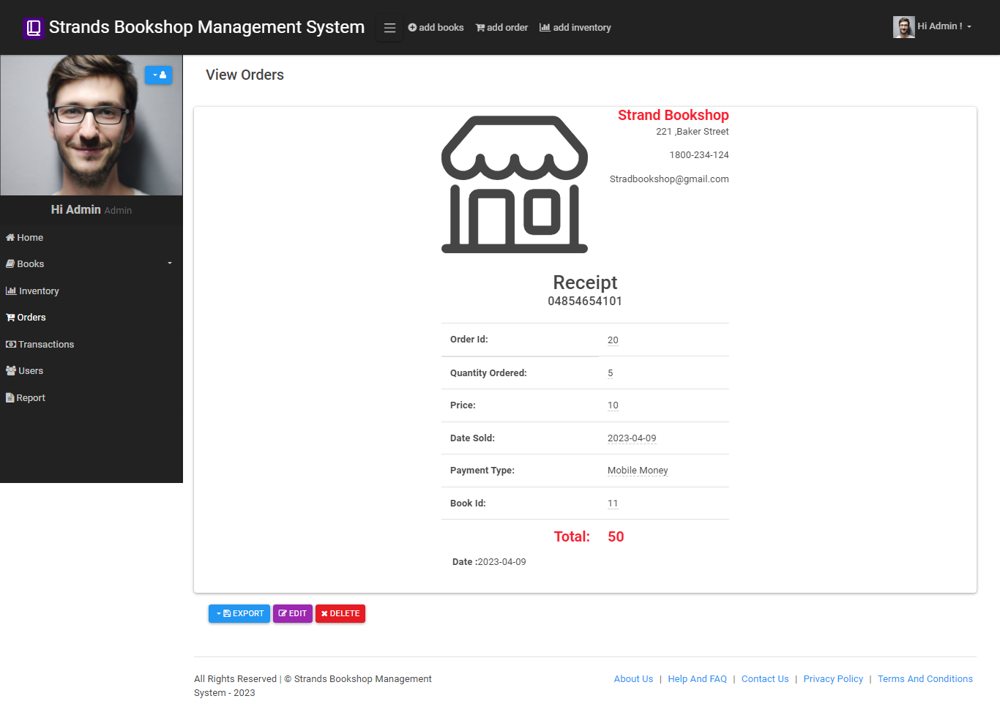
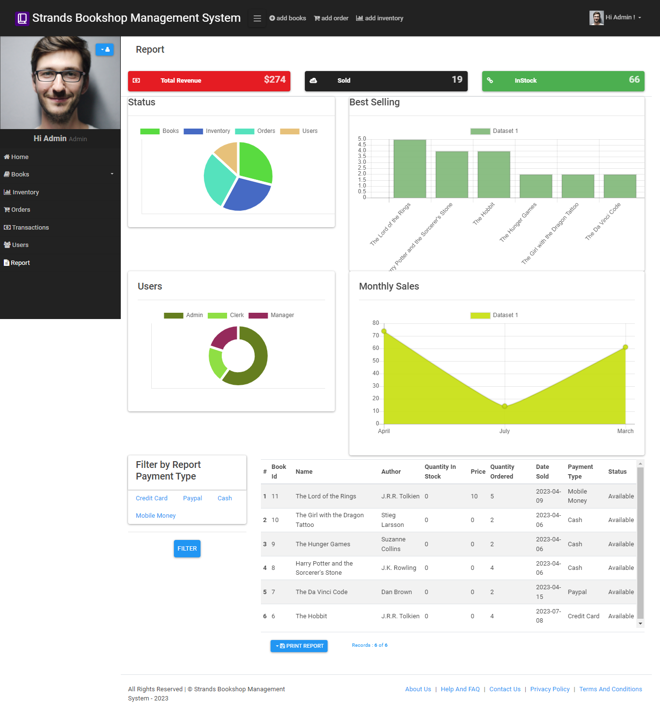
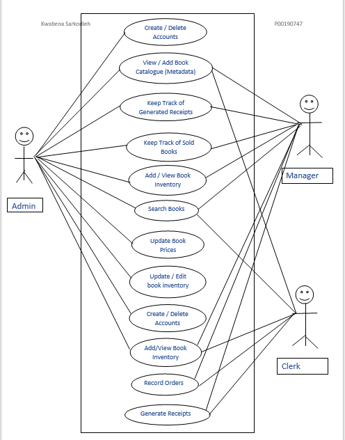
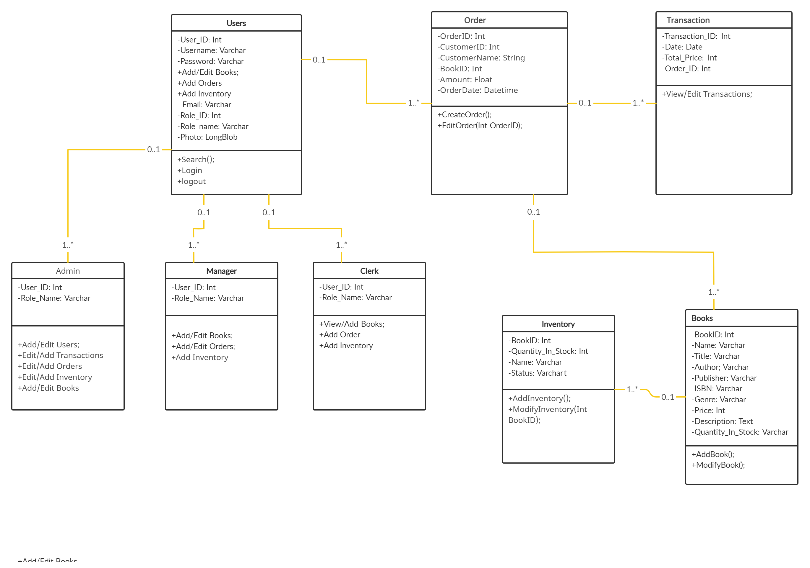

# Bookshop-Management-System

This is a bookshop management system built using PHP.This system provides various functionalities to different user roles, such as Admin, Manager, and Clerk
### Demo Admin Login
* username: Admin
* password: 12345
## [Click me](https://bookshop-management-systems.000webhostapp.com/)

## Features

- **Authentication**: The system allows Admins to create user accounts with specific access restrictions, and users can log in to access the system with their credentials.
- **Search Functionality**: All users can search for books by title or author using the search functionality.
- **Receipt Generation**: The Manager and the Clerk can generate receipts for sold books, and the Admin can keep track of the generated receipts.
- **Account Management**: The Admin can create, view, and edit accounts of the Manager and Clerk.
- **Book Catalogue Management**: The Admin and the Manager can view and edit book catalogues such as title and metadata.
- **Book Inventory Management**: The Clerk and the Manager can keep track of books on shelves, availability of books, and record sold books.
- **Report Generation**: The Admin and the Manager can generate reports such as sold books, damaged books, and book inventory status.
- **Sales Recording**: The Admin can view the recorded sales made by the manager and clerk.

## Screenshots

## Login Page

## Book Management Page

## Receipt Page

## Report Page

##  Diagrams
### use case diagram

### class diagram

