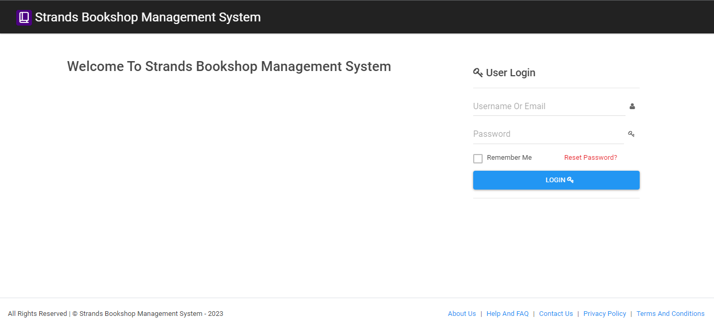

# Bookshop-Management-System

This is a bookshop management system built using PHP.
### Demo Login
username:Admin
password:12345

## Features

- **Authentication**: Admin can create an account for users to login to access the system.
- **Book Management**: Users can add, view, edit and delete books from the system.
- **Author Management**: Users can manage authors for each book, add new authors, view, edit and delete authors from the system.
- **Category Management**: Users can manage book categories, add new categories, view, edit and delete categories from the system.
- **Order Management**: Users can place orders, view all orders, view order details and cancel orders.
- **Reports**: Users can view reports on books, authors, categories and orders.

## Usage

1. Open the web browser and navigate to the index page.
2. Login with your account details.
3. Start managing books, authors, categories and orders.

## Screenshots

##  Diagrams

[Class](screenshots/classdiagram.png)

