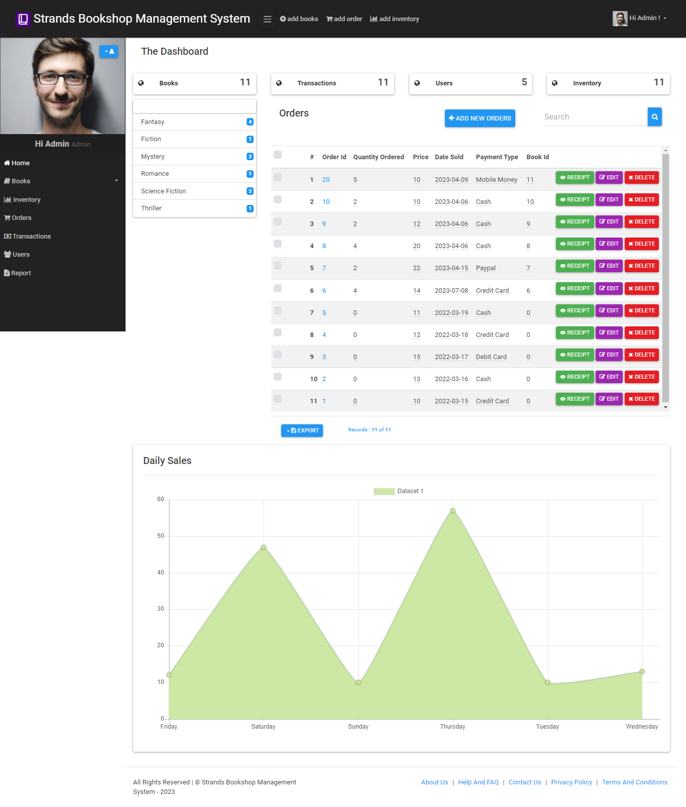

# Bookshop-Management-System

This is a bookshop management system built using PHP.
### Demo Login
username:Admin
password:12345

## Features

- **Authentication**: Admin can create an account for users to login to access the system.
- **Search functionality**: All users can search for books by title or author using the search functionality.
- **Receipt Generation**: The manager and the clerk can generate receipts for sold books, and the Admin can keep track of the generated receipts.
- **Admin to manage accounts**: The admin can create, view, and edit accounts of the Manager and Clerk.
- **Admin/Manager to keep track of books**: The Admin and the Manager can view and edit book catalogues such as title and metadata.
- **Manager/Clerk to keep track of book inventory**: The Clerk and the Manager can keep track of books on shelves, availability of books, and record sold books.
- **Generate Reports**: The Admin and the Manager can generate reports such as sold books, damaged books, and book inventory status.
- **Admin can view recorded sales**: The Admin can view the recorded sales made by the manager and clerk.
- **Clerk record book metadata**: The Clerk can record book metadata like name, title, shelf location, and availability into the system.
- **Admin can change book price**: The system should only allow the admin to edit and update book prices.
- **Manager can view generated receipts**: The Manager can view generated receipts.

## Usage

1. Open the web browser and navigate to the index page.
2. Login with your account details.
3. Start managing books, authors, categories and orders.

## Screenshots

##  Diagrams

[Class](screenshots/classdiagram.png)

